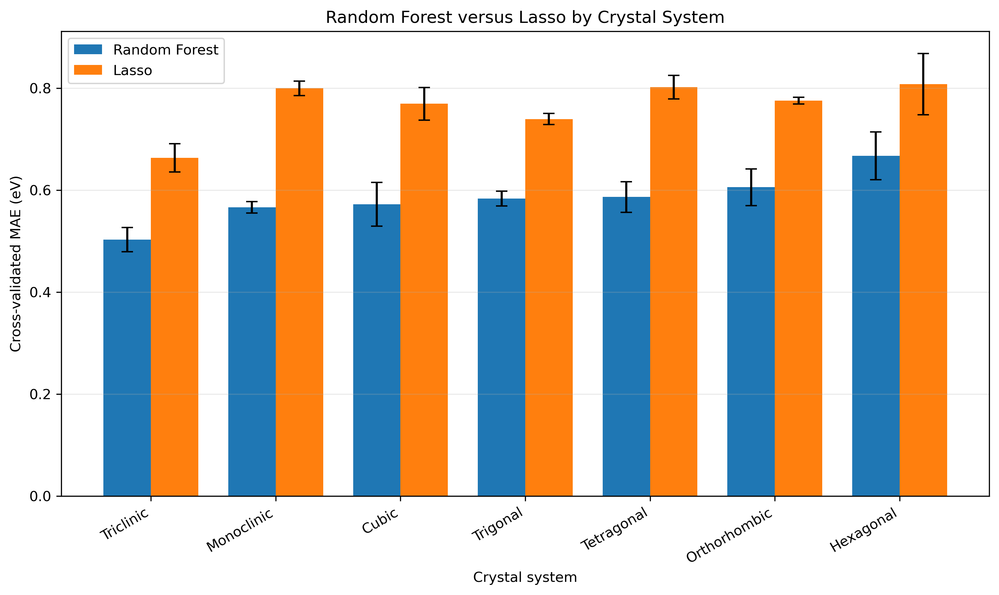
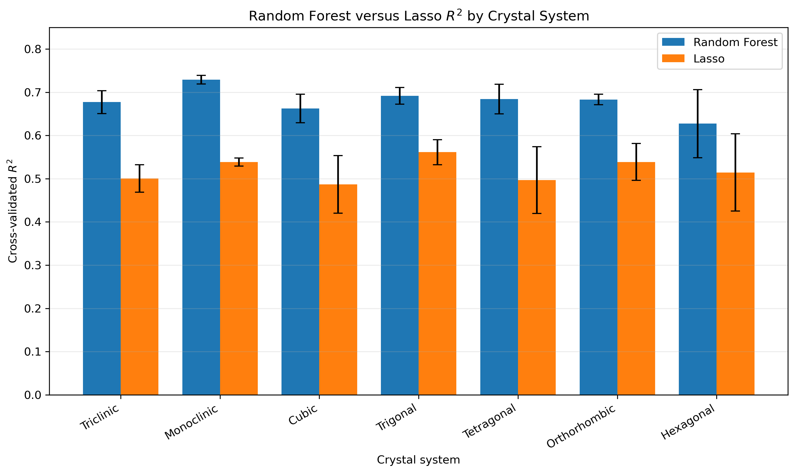
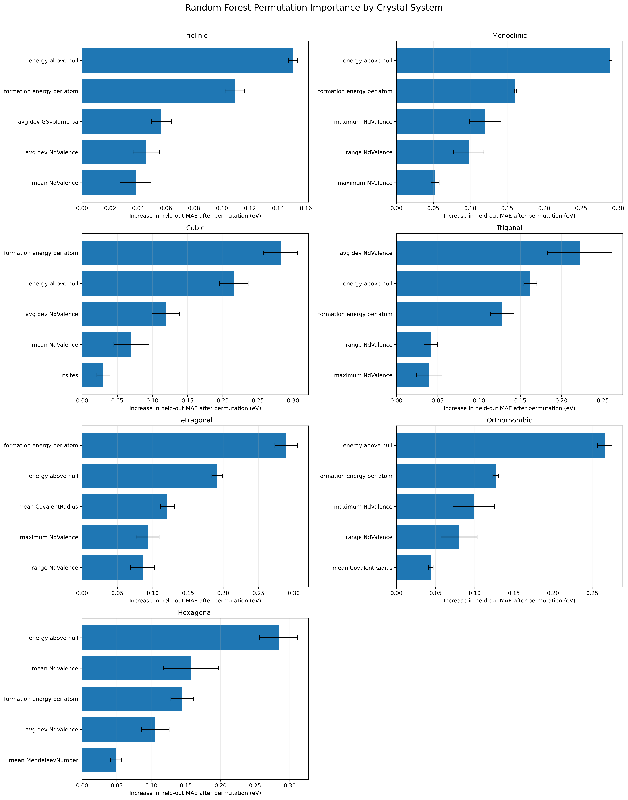

# Non-metallic Oxygen-Containing Materials Band-Gap Prediction

## 1. Scientific Question

Can composition-based MAGPIE descriptors and stability-related metadata predict
DFT-calculated band gaps of non-metallic oxygen-containing inorganic materials,
and do model performance and important predictors differ across crystal systems
under reduced-formula grouped cross-validation?

## 2. Project Overview

This project uses machine learning to predict DFT-calculated band gaps obtained
from the Materials Project.

The modeling variables include:

- 132 MAGPIE composition descriptors
- Number of elements
- Formation energy per atom
- Energy above the convex hull
- Density
- Cell volume
- Number of atomic sites
- Crystal system for the whole-dataset baseline

Random Forest is used as the nonlinear model, while Lasso regression is used as
a sparse linear comparison model. Separate Random Forest and Lasso models are
also evaluated for each of the seven crystal systems.

To prevent composition leakage, cross-validation is grouped by reduced formula.
Materials with the same reduced composition therefore cannot appear in both the
training and validation portions of a fold.

## 3. Data Source and Scope

The original materials records were downloaded through the Materials Project
API.

The API query retained materials that:

- Contain oxygen
- Contain between two and four elements
- Are reported as non-metallic
- Have a DFT-calculated band gap greater than 0.1 eV
- Have a valid crystal-system assignment

The raw project dataset contains:

- **40,078 materials**
- **22,816 unique reduced-formula groups**
- **Seven crystal systems**

The processed modeling dataset contains:

- 132 MAGPIE composition descriptors
- Six numerical stability and structure metadata features
- DFT-calculated band gap as the target property
- Reduced formula as the cross-validation grouping variable

The operational API filter creates a broad oxygen-containing dataset. It can
include multianion materials and is therefore broader than a strict
binary-oxide-only dataset.

### Crystal-System Sample Counts

| Crystal system | Samples |
|---|---:|
| Monoclinic | 14,447 |
| Triclinic | 9,095 |
| Orthorhombic | 8,160 |
| Trigonal | 2,796 |
| Tetragonal | 2,727 |
| Cubic | 1,782 |
| Hexagonal | 1,071 |

### Materials Project Citation

Jain, A. et al.  
“Commentary: The Materials Project: A materials genome approach to accelerating
materials innovation.”  
*APL Materials* **1**, 011002 (2013).  
https://doi.org/10.1063/1.4812323

Materials Project website:

```text
https://materialsproject.org/
```

## 4. Repository Structure

```text
zhao-oxide-bandgap-project/
├── README.md
├── environment.yml
├── .env.example
├── .gitignore
├── notebooks/
│   ├── 01_data_acquisition.ipynb
│   ├── 02_eda_featurization.ipynb
│   ├── 03_modeling.ipynb
│   └── 04_results_visualization.ipynb
├── data/
│   ├── README.md
│   ├── zhao_nonmetal_oxide_bandgap_project.csv
│   ├── zhao_nonmetal_oxide_bandgap_magpie_project.csv
│   ├── crystal_system_rf_results.csv
│   ├── crystal_system_lasso_results.csv
│   ├── crystal_system_lasso_fold_results.csv
│   ├── crystal_system_lasso_feature_summary.csv
│   ├── crystal_system_permutation_importance_seeds.csv
│   ├── crystal_system_permutation_importance_summary.csv
│   ├── rf_lasso_top_feature_comparison.csv
│   └── final_model_performance_summary.csv
└── figures/
    ├── bandgap_distribution.png
    ├── crystal_system_counts.png
    ├── metadata_correlation_matrix.png
    ├── rf_vs_lasso_mae_by_crystal_system.png
    ├── rf_vs_lasso_r2_by_crystal_system.png
    └── permutation_importance_by_crystal_system.png
```

Large CSV files may be omitted from GitHub if they exceed repository or course
file-size limits. They can be regenerated by running the notebooks in order.

## 5. Environment Setup

Create the Conda environment:

```bash
conda env create -f environment.yml
```

Activate the environment:

```bash
conda activate zhao-oxide-bandgap
```

Start JupyterLab from the repository root:

```bash
jupyter lab
```

The project uses Python, Pandas, NumPy, Matplotlib, Scikit-learn, Pymatgen,
Matminer, mp-api, and python-dotenv.

## 6. Materials Project API Key

The data-acquisition notebook requires a Materials Project API key.

Create a private file named `.env` in the repository root:

```text
MP_API_KEY=your_actual_materials_project_api_key
```

The repository includes `.env.example` as a template:

```text
MP_API_KEY=your_materials_project_api_key_here
```

The real `.env` file is excluded through `.gitignore` and must never be
committed to GitHub. The notebook does not print or store the API key.

## 7. Notebook Execution Order

Run the notebooks in this order:

1. `notebooks/01_data_acquisition.ipynb`
2. `notebooks/02_eda_featurization.ipynb`
3. `notebooks/03_modeling.ipynb`
4. `notebooks/04_results_visualization.ipynb`

### 01 — Data Acquisition

This notebook:

- Loads the Materials Project API key from `.env`
- Queries the Materials Project API
- Applies the project filters
- Generates reduced formulas
- Saves the raw project dataset

### 02 — EDA and MAGPIE Featurization

This notebook:

- Examines the band-gap distribution
- Reports crystal-system sample counts
- Checks missing values
- Performs correlation analysis
- Generates or loads 132 MAGPIE descriptors
- Saves the processed modeling dataset

### 03 — Modeling

This notebook:

- Evaluates a whole-dataset Random Forest baseline
- Confirms zero reduced-formula overlap between folds
- Evaluates Random Forest models for each crystal system
- Evaluates nested-CV Lasso models for each crystal system
- Saves fold-level and summary model results
- Computes held-out Random Forest permutation importance across five seeds

### 04 — Results Visualization

This notebook:

- Compares Random Forest and Lasso MAE
- Compares Random Forest and Lasso R²
- Plots permutation importance with uncertainty
- Compares the top Random Forest and Lasso predictors
- Produces a final performance summary table
- Saves the final report figures

## 8. Validation Strategy

The principal validation method is five-fold `GroupKFold`, grouped by
`reduced_formula`.

Reduced-formula grouping is necessary because multiple Materials Project
records can have the same stoichiometric composition. Polymorphs with the same
composition also have identical MAGPIE composition descriptors.

Allowing the same reduced composition in both training and validation sets could
produce an overly optimistic estimate of performance on unseen compositions.

The overlap checks confirmed:

```text
Reduced-formula overlap = 0
```

for every evaluated fold.

The crystal-system Lasso models use nested grouped cross-validation:

- Five outer `GroupKFold` folds for performance evaluation
- Five inner `GroupKFold` folds for selecting the Lasso regularization strength
- Quantile clipping learned only from each training fold
- Near-constant feature removal
- Standardization learned only from each training fold

Random Forest permutation importance is evaluated on a fixed held-out
reduced-formula fold using five model seeds. Each feature is permuted five times,
and the reported uncertainty represents variation across the five seeds.

## 9. Results

### Whole-Dataset Random Forest Baseline

The whole-dataset Random Forest uses:

- 132 MAGPIE descriptors
- Six numerical metadata features
- One-hot-encoded crystal system

Five-fold reduced-formula GroupKFold performance:

- **MAE: 0.535 ± 0.012 eV**
- **R²: 0.740 ± 0.008**
- **Reduced-formula overlap: 0 in every fold**

### Crystal-System-Specific Models

| Crystal system | RF MAE (eV) | RF R² | Lasso MAE (eV) | Lasso R² |
|---|---:|---:|---:|---:|
| Triclinic | 0.503 ± 0.024 | 0.677 ± 0.026 | 0.663 ± 0.028 | 0.501 ± 0.032 |
| Monoclinic | 0.567 ± 0.011 | 0.729 ± 0.010 | 0.800 ± 0.014 | 0.538 ± 0.009 |
| Cubic | 0.572 ± 0.043 | 0.663 ± 0.033 | 0.770 ± 0.032 | 0.487 ± 0.067 |
| Trigonal | 0.583 ± 0.014 | 0.692 ± 0.019 | 0.740 ± 0.011 | 0.561 ± 0.029 |
| Tetragonal | 0.587 ± 0.030 | 0.684 ± 0.034 | 0.802 ± 0.023 | 0.497 ± 0.077 |
| Orthorhombic | 0.606 ± 0.036 | 0.683 ± 0.012 | 0.776 ± 0.007 | 0.539 ± 0.043 |
| Hexagonal | 0.667 ± 0.047 | 0.627 ± 0.079 | 0.808 ± 0.060 | 0.514 ± 0.089 |

Random Forest outperformed Lasso for all seven crystal systems.

The Random Forest improvement relative to Lasso was:

- MAE reduction of approximately **0.141–0.234 eV**
- R² improvement of approximately **0.113–0.190**

The triclinic Random Forest achieved the lowest MAE. The monoclinic Random
Forest achieved the highest R². The hexagonal subset showed the largest
uncertainty, consistent with its smaller sample size.

### Feature Importance

Random Forest permutation importance showed that the following variables were
frequently influential:

- Energy above the convex hull
- Formation energy per atom
- NdValence-related MAGPIE descriptors
- Covalent-radius descriptors in selected crystal systems

Formation energy per atom appeared in the top-three feature lists of both
Random Forest and Lasso for six of the seven crystal systems.

The two model classes did not select identical feature sets. Random Forest
permutation importance can reflect nonlinear relationships and feature
interactions, whereas standardized Lasso coefficients describe sparse linear
relationships.

## 10. Figures

### Random Forest versus Lasso MAE



### Random Forest versus Lasso R²



### Random Forest Permutation Importance



## 11. Limitations

- Materials Project band gaps are DFT-calculated rather than experimental.
- MAGPIE descriptors do not directly encode full atomic structure.
- The API query produces a broad oxygen-containing dataset rather than a strict
  binary-oxide-only dataset.
- Crystal-system subsets differ substantially in sample size.
- Permutation importance was evaluated on one fixed held-out grouped fold rather
  than averaged across all cross-validation folds.
- Ordinary Lasso can produce slightly negative band-gap predictions because it
  does not impose a physical non-negativity constraint.

## 12. Reproducibility

Each notebook was tested using:

```text
Kernel → Restart Kernel and Run All Cells
```

The notebooks use repository-relative paths and do not contain:

- Hardcoded API keys
- Hardcoded user-specific Windows paths
- Reduced-formula leakage between training and validation folds
- Dependencies on undocumented notebook execution order

For complete reproduction, create the environment, add a private Materials
Project API key, and execute the four notebooks in numerical order.

## 13. Author

Yixin Zhao  
EMA 6938 — Data Science for Materials  
University of Florida
